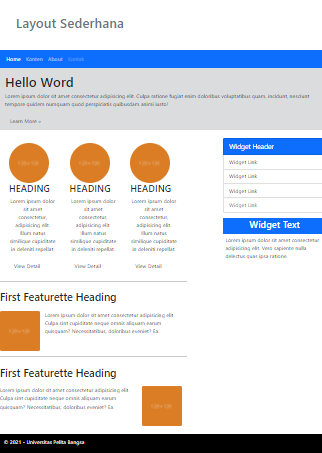
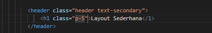
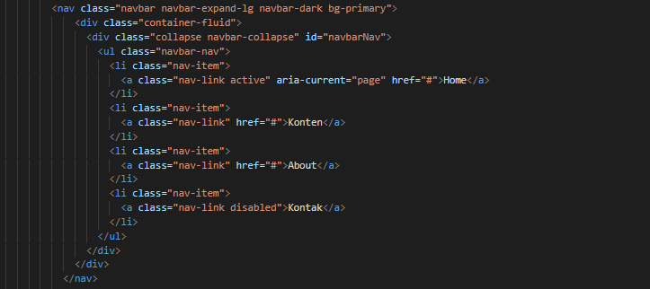
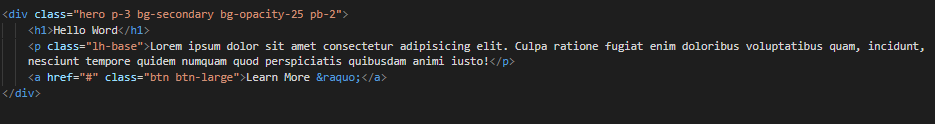
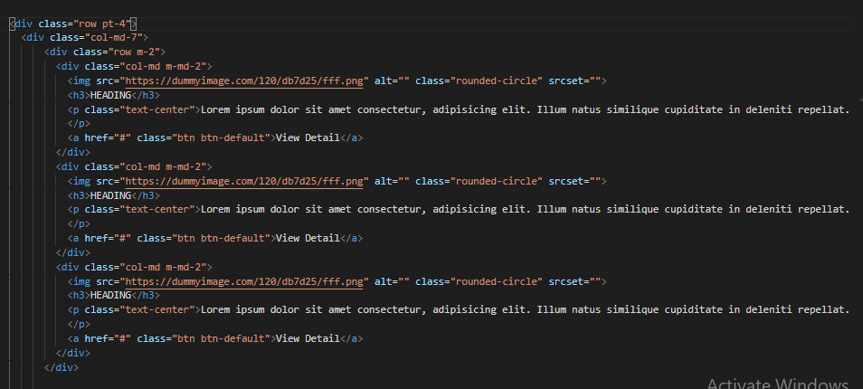
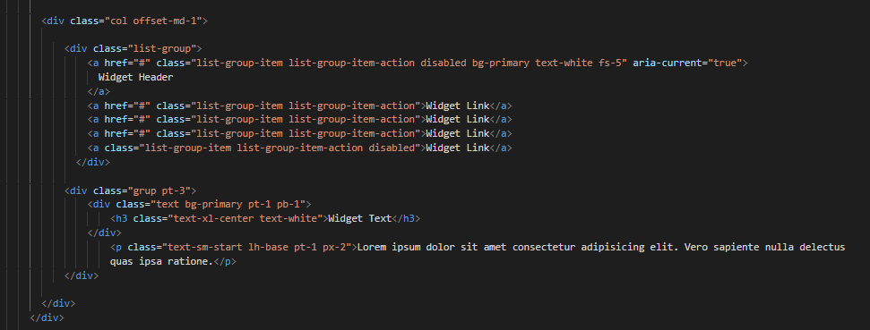
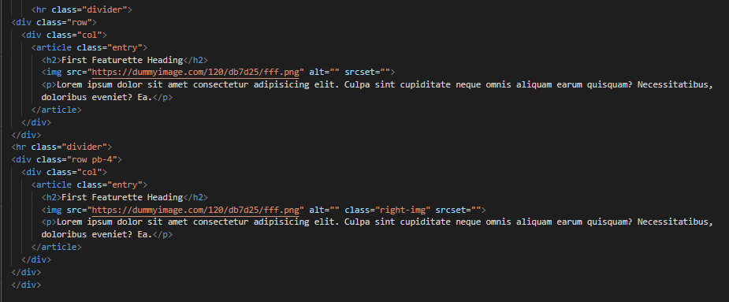
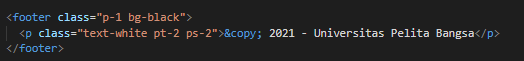
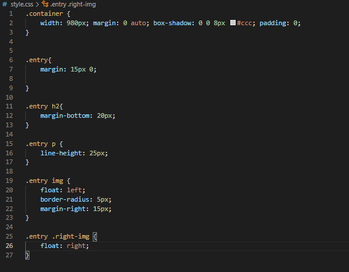

# Lab6Web
MUHAMMAD SAFRI SATRIA PERMANA 
TI.20.A.2 

Web Framework

Membuat Program HTML Dengan Web FrameWork

## Langkah - langkah
1. Membuat Header

2. Membuat Navbar

3. Membuat class hero

4. Membuat class main

5. Membuat class devider

6. Membuat footer

7. Membuat css untuk mengatur Web Frameworknya

